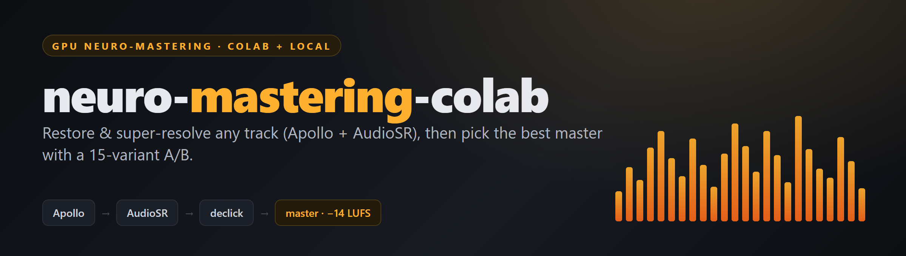
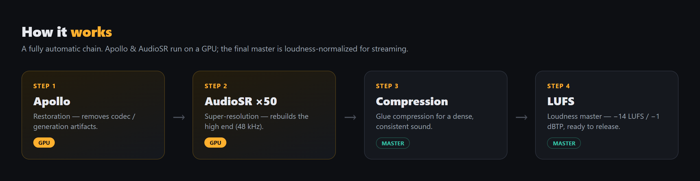
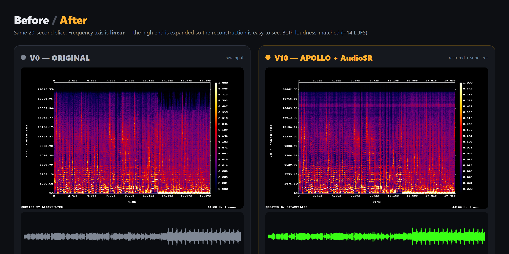

# neuro-mastering-colab

**Restore and super-resolve any track on a free GPU — fully automatic.**
Feed in a rough, lo-fi or AI-generated track; get back a clean, release-ready master.

### ▶ Live demo — see it & hear it

[](https://neuro-mastering-ab.vercel.app/)

Full before/after tracks, processing-chain comparisons and spectrograms you can listen to,
right in your browser → **<https://neuro-mastering-ab.vercel.app/>**

---

## How it works

Just **sign in with your Gmail** — then everything runs automatically. No setup, no audio
engineering. The whole chain runs on a free Google Colab GPU.



```
input  →  Apollo (restore)  →  AudioSR ×50 (super-resolution)  →  Compression  →  LUFS (-14)
```

1. **Apollo** — restoration, removes codec / generation artifacts. *(GPU)*
2. **AudioSR ×50** — super-resolution, rebuilds the high end at 48 kHz. *(GPU)*
3. **Compression** — glue compression for a dense, consistent sound.
4. **LUFS** — loudness master to −14 LUFS / −1 dBTP, ready to release.

## Before / after



Same 20-second slice: **V0 (original)** vs **V10 (Apollo → AudioSR)**. The frequency axis is
**linear**, so the high end is expanded — you can see the reconstruction fill the top half with
cleaner, denser detail (the "air"). Both loudness-matched (−14 LUFS).

## Run it yourself

[](https://colab.research.google.com/github/kymaman/neuro-mastering-colab/blob/main/colab/mastering.ipynb)

1. Click **Open in Colab** above.
2. **Runtime → Change runtime type → T4 GPU → Save** (it's free).
3. Run the cells — **sign in with your Google account** when prompted, upload your track, and
   wait. The final master prints a download link when it's done.

Full step-by-step: [`docs/COLAB.md`](docs/COLAB.md). Running on your own NVIDIA machine:
[`docs/LOCAL.md`](docs/LOCAL.md).

## Repo layout
```
colab/
  run_all.sh         full pipeline, one-shot (Colab or local Linux + GPU)
  test_asr.sh        ~1-min dependency sanity check
  sitecustomize.py   numpy shim so the super-resolution step runs on Python 3.12
  mastering.ipynb    ready Colab notebook (the "Open in Colab" target)
  input/             put your audio here (gitignored)
scripts/             restoration, segment-join, declick, tail-guard helpers
agent/               optional helpers to drive Colab headless (for automation)
docs/                guides — start with docs/00_START_HERE_AGENT.md
assets/              images
```

## Notes / credits
- Restoration: [JusperLee/Apollo](https://github.com/JusperLee/Apollo).
- Super-resolution: AudioSR (installed with a numpy pin — see docs).
- No secrets live in this repo. Google login is entered interactively / via environment
  variables only; audio inputs, cookies and browser profiles are gitignored.

## License
MIT — see [`LICENSE`](LICENSE).
